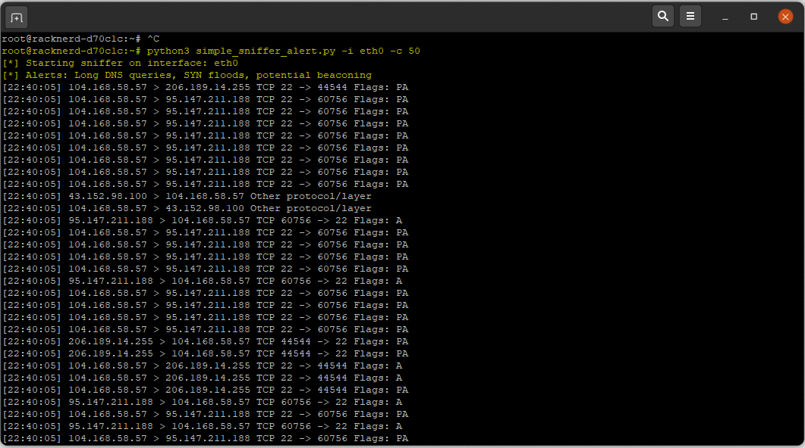
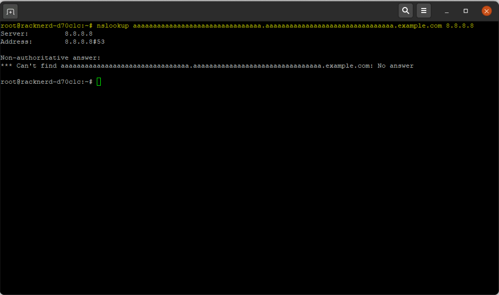

# 🔍 Simple Packet Sniffer with Basic Threat Alerts

A lightweight Python based network packet sniffer built with Scapy that monitors live traffic and provides real-time alerts for suspicious activity.

Perfect for learning network security fundamentals and building a hands on cybersecurity portfolio.

---

## 📖 About

This tool captures live network packets on a specified interface and displays key details (source/destination IP, ports, protocol, flags).  
More importantly, it includes simple but effective detection rules to flag common threats, giving you practical exposure to how SOC analysts monitor and triage network activity.

Built as an educational project to practice packet analysis, scripting detection logic, and understanding real world network threats.

No external dependencies beyond Scapy, just pure Python.

---

## ✨ Features

📡 Live packet capture and readable summaries  
⚠️ Real-time alerts for:  
- Suspiciously long DNS queries (potential DNS tunneling/exfiltration)  
- High volume of SYN packets from a single source (potential port scan or SYN flood)  
- Regular timed connections (potential C2 beaconing)  
🔇 Default filter excludes noisy SSH traffic (port 22) for cleaner output on servers  
⌨️ Command-line options for interface selection and packet limit  
🧠 Easy to extend with new detection rules  

---

## 🧠 What I Learned

- Understanding packet structure and network protocols (IP, TCP, UDP, DNS)
- Writing detection logic for common threats using timing, volume, and pattern analysis
- Using Scapy for packet capture and parsing in Python
- Filtering traffic with BPF to reduce noise in real environments
- Building clean, readable tools that simulate blue team monitoring workflows
- Documenting and presenting security projects for a professional portfolio

---

## 🖼️ Examples & Alerts

Here are real outputs from running the sniffer on a live server:

### Normal Traffic Capture

### Suspicious Long DNS Query Alert (Potential Tunneling)

---

## 🛠 Requirements

### Requirements
- Python 3.6+
- Scapy (`pip install scapy`)
- Root/admin privileges (required for raw packet capture)
